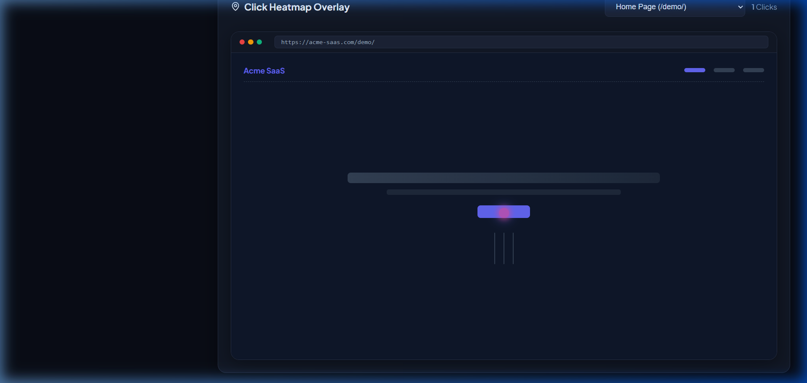
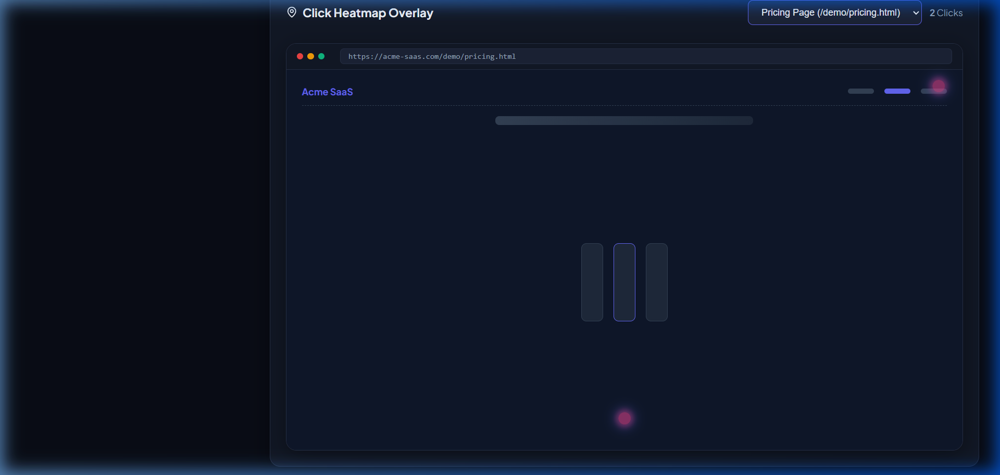
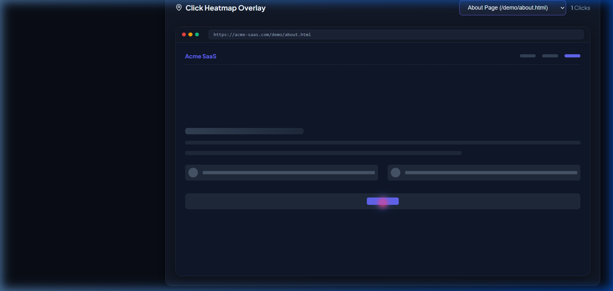

# CasualFunnel - User Analytics Application

An end-to-end user behavior tracking and analytics application. The system captures user actions (page views and mouse clicks) on a static demo website, stores them in MongoDB, and visualizes them on a modern, dark-themed React dashboard with chronological journeys and click heatmaps.

---

## 🚀 Live Deployments

* **Analytics Dashboard Panel (Vercel)**: [https://casual-funnel-sigma.vercel.app/](https://casual-funnel-sigma.vercel.app/)
* **Tracked Demo Website (Render)**: [https://casualfunnel-h1ph.onrender.com/demo/](https://casualfunnel-h1ph.onrender.com/demo/)
* **Backend API Server (Render)**: [https://casualfunnel-h1ph.onrender.com/](https://casualfunnel-h1ph.onrender.com/)

---

## Key Features

1. **Standalone Tracker (`tracker/tracker.js`)**:
   * Generates and stores persistent `session_id`s in `localStorage`.
   * Captures `page_view` events.
   * Tracks mouse clicks with both raw pixel coordinates (`x`, `y`) and normalized viewport percentage coordinates (`x_pct`, `y_pct`) for resolution-independent heatmaps.
   * Uses `fetch` with `keepalive: true` to prevent event loss during page unloads/navigation.

2. **Modular Express Backend**:
   * **Required Primary Database**: Uses MongoDB (via Mongoose) as the required primary database to store interaction data.
   * **Development Fallback**: Includes an optional, automatic in-memory database mock. If MongoDB is not running locally, the server starts with a warning and falls back to this in-memory proxy for testing convenience.
   * Responsibilities separated cleanly across:
     * `eventController.js` (Ingestion)
     * `sessionController.js` (Session lists, journeys, dashboard metrics)
     * `heatmapController.js` (Heatmap coordinates by URL)
   * Serves the multi-page demo site at `/demo/` and the tracker script at `/tracker.js`.

3. **Multi-page Demo Site**:
   * Three static pages: Home, Pricing, and About.
   * Demonstrates real-world session flows and navigation tracking.

4. **Interactive Analytics Dashboard (React + Vite)**:
   * **Sessions List View (Core Requirement)**: Live sidebar showing active sessions and interaction counts.
   * **Chronological Session Journey (Core Requirement)**: Displays the exact timeline path of page visits and clicks with coordinates.
   * **Visual Heatmap Overlay (Core Requirement)**: Embeds wireframe mockups for Home, Pricing, and About pages, overlaying collected click percentages dynamically.
   * **Dashboard Statistics (Bonus Feature)**: Visualizes Total Sessions, Total Events, Total Clicks, and Click-through rate.

---

## Setup & Running Guide

### 1. Prerequisites
* [Node.js](https://nodejs.org/) (v16+ recommended)
* [MongoDB](https://www.mongodb.com/) running locally or via MongoDB Atlas.
  > [!NOTE]
  > MongoDB is the required primary database. In production (`NODE_ENV=production`), the application strictly connects to MongoDB Atlas using `MONGO_URI` and will exit on failure. In local development, if `MONGO_URI` is unset, it falls back to an in-memory database proxy for zero-config testing.

### 2. Local Development

1. **Install all dependencies** (Root, Backend, and Frontend):
   ```bash
   npm run install-all
   ```

2. **Start the backend and frontend dev servers concurrently**:
   ```bash
   npm run dev
   ```

Once running, access:
* **Tracked Demo Website**: [http://localhost:5000/demo/](http://localhost:5000/demo/)
* **Analytics Dashboard Panel**: [http://localhost:5173/](http://localhost:5173/)

---

## 🌐 Production Deployment Configurations

### Backend (Render Deployment)
* **Root Directory**: `backend`
* **Runtime**: `Node`
* **Build Command**: `npm install`
* **Start Command**: `node server.js`
* **Required Environment Variables**:
  * `MONGO_URI`: Your MongoDB Atlas Connection String
  * `NODE_ENV`: `production`

### Frontend (Vercel Deployment)
* **Framework Preset**: `Vite` (automatically detected)
* **Root Directory**: `frontend`
* **Build Command**: `npm run build`
* **Output Directory**: `dist`
* **Required Environment Variable**:
  * `VITE_API_BASE`: `<Your Render Backend URL>/api` (e.g. `https://casualfunnel-h1ph.onrender.com/api`)

---

---

## 🖼️ Visual Walkthrough

Below are the dashboard states capturing the platform interface and click coordinate heatmap overlays:

* **Video Walkthrough Demo**: Refer to [walkthrough.md](./walkthrough.md) for the full step-by-step video walkthrough of all pages.

### Dashboard & Heatmap Visualizations
| Home Page Heatmap | Pricing Page Heatmap | About Page Heatmap |
|---|---|---|
|  |  |  |

---

## Tech Stack
* **Frontend Dashboard**: React, Vite, Axios, Lucide Icons, Custom Vanilla CSS
* **Tracking Script**: Vanilla JS (using standard Web APIs)
* **Backend API**: Node.js, Express, Mongoose, CORS, Dotenv, Nodemon
* **Database**: MongoDB (Required primary store)
